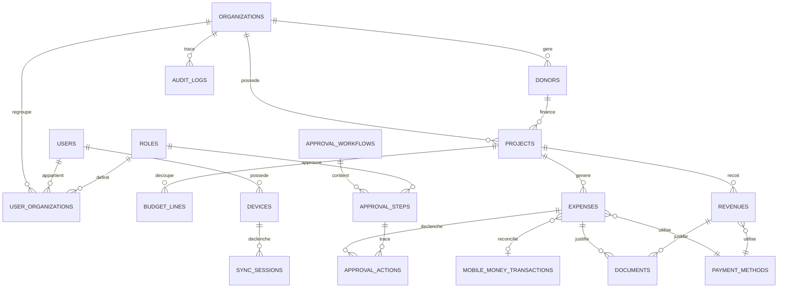

# Schéma de base de données — ONG Finance Pro

Deux fichiers SQL accompagnent ce document :
- `postgresql_schema.sql` — base serveur (source de vérité, multi-organisation)
- `sqlite_schema.sql` — base locale sur chaque appareil (offline-first)

## 1. Diagramme relationnel simplifié (entités cœur)

## 2. Logique de conception

**Multi-tenant strict** — Toutes les tables métier portent `organization_id`. Chaque requête API doit filtrer dessus (idéalement via Row Level Security PostgreSQL, exemple activable en bas du fichier `postgresql_schema.sql`). Ceci empêche qu'une ONG A voie les données d'une ONG B, même en cas de bug applicatif.

**Multi-devise** — `amount` + `currency` sur chaque dépense/recette, avec `amount_in_org_currency` calculé au moment de la saisie via `exchange_rates`. Indispensable car un projet financé par l'UE peut être budgétisé en EUR mais dépensé en XOF sur le terrain.

**Workflow d'approbation configurable** — plutôt qu'un statut binaire "validé/pas validé", `approval_workflows` + `approval_steps` permettent à chaque ONG de définir sa propre chaîne (ex : agent terrain → chef de projet → coordinateur si le montant dépasse 500 000 FCFA). `approval_actions` conserve l'historique complet, y compris les rejets et retours.

**Mobile Money comme citoyen de première classe** — `mobile_money_transactions` est une table dédiée, pas juste un champ texte. Elle stocke le payload brut de l'opérateur (`raw_payload JSONB`) pour audit, et permet une réconciliation automatique avec les dépenses/recettes déclarées.

**Plan comptable SYSCOHADA** — `expense_categories` est hiérarchique (`parent_id`) et peut être pré-remplie avec le plan comptable OHADA standard (organization_id NULL = modèle global), que chaque ONG peut ensuite personnaliser.

**Documents avec intégrité** — `sha256_hash` sur chaque document permet de détecter les doublons et de vérifier qu'un justificatif n'a pas été altéré après upload — important pour les audits bailleurs.

## 3. Différences PostgreSQL ↔ SQLite

| Aspect | PostgreSQL (serveur) | SQLite (local) |
|---|---|---|
| Identifiants | `UUID` natif | `TEXT` (UUID généré côté client) |
| Types stricts | ENUM, JSONB, INET | Tout en `TEXT`/`REAL`/`INTEGER` (typage faible SQLite) |
| Suppression | Vraie contrainte `ON DELETE CASCADE` | Soft delete (`is_deleted`) — la suppression réelle attend confirmation du serveur |
| Colonnes en plus | — | `sync_status`, `is_dirty`, `local_updated_at`, `server_updated_at`, `server_id` |
| Référentiels (rôles, méthodes de paiement...) | Table complète | Copie en cache (`_local`), en lecture seule, rafraîchie à chaque sync |

**Pourquoi `server_id` séparé de `id` côté SQLite ?**
Un agent terrain peut créer une dépense hors ligne pendant plusieurs jours. Elle a besoin d'un identifiant immédiatement (généré localement en UUID) pour que l'app fonctionne sans réseau. Une fois synchronisée, le serveur peut avoir généré son propre `id` définitif (ou valider celui du client) — `server_id` fait le lien entre les deux mondes sans jamais casser les références locales déjà utilisées par les documents attachés, par exemple.

## 4. La file `sync_queue` et la priorité

Le champ `priority` (1 = critique, 9 = accessoire) permet de faire remonter en premier les **montants et statuts d'approbation** avant les **pièces jointes lourdes** (photos de factures), ce qui est décisif sur une connexion 2G intermittente typique des zones rurales béninoises. Un chef de projet en ville peut ainsi voir les chiffres remonter en quelques secondes, même si les photos justificatives arrivent une heure plus tard.

## 5. Prochaines étapes possibles

- Écrire les migrations Laravel correspondant à `postgresql_schema.sql`
- Définir le plan comptable SYSCOHADA par défaut (données de départ pour `expense_categories`)
- Concevoir la logique du moteur de synchronisation (détection de conflit, résolution, ordre de priorité)
- Modéliser les templates de rapports par bailleur (`report_templates.structure`)

Dites-moi laquelle de ces suites vous intéresse, ou si vous voulez d'abord ajuster ce schéma (ajouter/retirer des champs, revoir le workflow d'approbation, etc.).
